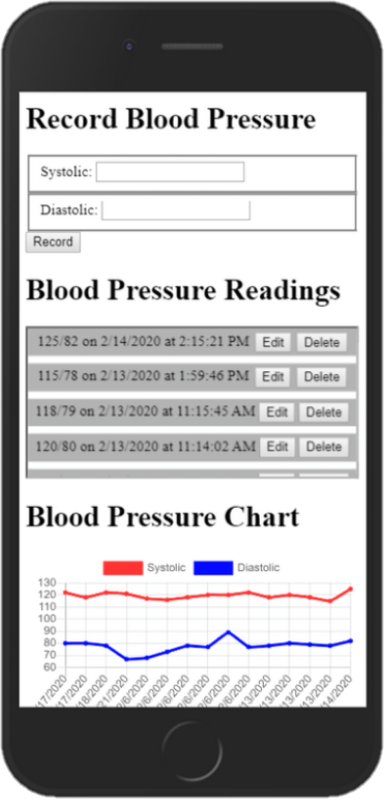

# MedJournal: A Personal Healthcare Tracker App



## Project Description

MeddJournal is a mobile-focused web application designed for users to easily access and log medical details in one convenient location. The app utilizes a variety of easy-to-use forms to record health data which is then dynamically populated on the chart below to provide a detailed overview of past recordings. All recordings can be edited and deleted from the list, dynamically effecting the chart as well. All charts can be viewed in the "Profile View" to give an overview of one's health to provide to a healthcare professional. The app also includes a Food Journal to record detailed information about meals and potential allergens. There is also a medication tracker to track if a medication has been taken for a given day. A timestamp is recorded when taken to provide the last time a medication was taken for a healthcare professional. 

Technologies used include React and Chart.js.

## Instructions

1. Clone this repository
1. `cd` into the directory it creates
1. Install the necessary packages with the following: 
  * npm install
  * npm i --save react-router-dom
  * npm install --save react-chartjs-2 chart.js
1. Make an `api` directory and touch `database.json`
1. Copy & paste sample api below into database
1. Run `json-server -w database.json -p 8088` from the `api` directory
1. In a separate terminal, `cd` into the `src` directory
1. npm start

## Sample Api

### users

```
  {
    "id": 1,
    "email": "me@me.com",
    "password": "123",
    "firstName": "First",
    "lastName": "Last"
  }
```

### bloodPressure

```
  {
    "id": 1,
    "systolic": 122,
    "diastolic": 80,
    "timestamp": 1579312120134,
    "userId": 1
  }
```

### bloodGlucose

```
  {
    "id": 1,
    "glucose": 100,
    "timestamp": 1579312120634,
    "userId": 1
  }
```

### weight

```
  {
    "id": 1,
    "weight": "181",
    "timestamp": 1579640023071,
    "userId": 1
  }
```

### activity

```
  {
    "id": 1,
    "userId": 1,
    "minutes": 90,
    "timestamp": 1579640023071
  }
```

### food

```
  {
    "id": 1,
    "meal": "Breakfast",
    "datetime": "2020-02-23T08:00",
    "notes": "Sausage, Eggs, Orange Juice",
    "userId": 1
  }
```

### medicine

```
  {
    "id": 1,
    "userId": 1,
    "name": "Levothyroxine",
    "dosage": "1.6 mccg/kg orally",
    "per": 1,
    "dayweekmonth": "day",
    "time": "16:00",
    "taken": false,
    "timestamp": 1581711412136
  }
```

## Author

* **Spencer Truett** - (https://github.com/SpencerTruett)